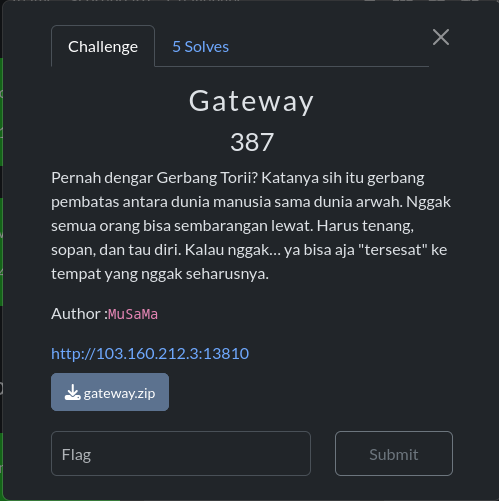

# Epoch Seal

<figure><figcaption></figcaption></figure>

Given a file named **ZXBvY2gg.apk,** so I proceed to extract the file using apktool

<figure><figcaption></figcaption></figure>

Then, cause the title of the challenge is epoch seal, I proceed to decompile the **libepochseal.so**:

**mainActivity\_checkPinActive**:

```c
__int64 __fastcall Java_com_schematics_epochseal_MainActivity_checkPinNative(__int64 *a1, __int64 a2, unsigned int a3)
{
  FILE *v5; // rax
  FILE *v6; // r14
  const char *v7; // rsi
  __int64 v8; // rax
  unsigned __int64 v10; // rsi
  char *v11; // rax
  __int64 v12; // r14
  __int64 v13; // rdi
  unsigned __int64 v14; // rdx
  __int64 v15; // r8
  unsigned __int64 v16; // rsi
  __int64 v17; // rsi
  char *v18; // rax
  __int64 i; // r8
  unsigned __int64 v20; // rdi
  void *v21; // rsi
  unsigned __int64 v22; // rdi
  unsigned __int64 v23; // rdi
  unsigned __int64 v24; // rdi
  unsigned __int64 v25; // rdx
  unsigned __int8 v26; // cl
  __int64 j; // rax
  char v28; // si
  __int64 v29; // rdx
  char v30; // si
  unsigned __int8 v31; // al
  unsigned __int8 v32; // dl
  __int64 k; // rsi
  char v34; // r8
  __int64 v35; // rbx
  unsigned __int8 v36; // [rsp+8h] [rbp-270h] BYREF
  char v37; // [rsp+9h] [rbp-26Fh] BYREF
  unsigned __int64 v38; // [rsp+10h] [rbp-268h]
  void *ptr; // [rsp+18h] [rbp-260h]
  char s[16]; // [rsp+20h] [rbp-258h] BYREF
  __int128 v41; // [rsp+30h] [rbp-248h]
  _OWORD v42[30]; // [rsp+40h] [rbp-238h] BYREF
  unsigned __int64 v43; // [rsp+220h] [rbp-58h]
  unsigned __int64 v44; // [rsp+228h] [rbp-50h]
  unsigned __int64 v45; // [rsp+230h] [rbp-48h]
  unsigned __int64 v46; // [rsp+238h] [rbp-40h]
  unsigned __int64 v47; // [rsp+240h] [rbp-38h]

  v47 = __readfsqword(0x28u);
  if ( (unsigned __int8)C_D() )
  {
LABEL_8:
    sleep(0x45u);
    v7 = fekFLAG;
    v8 = *a1;
    return (*(__int64 (__fastcall **)(__int64 *, const char *))(v8 + 1336))(a1, v7);
  }
  v5 = fopen("/proc/self/maps", "r");
  if ( v5 )
  {
    v6 = v5;
    while ( fgets(s, 512, v6) )
    {
      if ( strstr(s, "frida") || strstr(s, "gum-js-loop") )
      {
        fclose(v6);
        goto LABEL_8;
      }
    }
    fclose(v6);
  }
  if ( (unsigned int)sub_21DE0() != a3 )
  {
    v8 = *a1;
    v7 = "Try again";
    return (*(__int64 (__fastcall **)(__int64 *, const char *))(v8 + 1336))(a1, v7);
  }
  std::to_string((std::__ndk1 *)&v36, a3);
  if ( (v36 & 1) != 0 )
  {
    v10 = v38;
    if ( v38 )
    {
LABEL_15:
      if ( (v36 & 1) != 0 )
        v11 = (char *)ptr;
      else
        v11 = &v37;
      v13 = 0x14650FB0739D0383LL;
      v14 = v10 & 3;
      if ( v10 >= 4 )
      {
        v16 = v10 & 0xFFFFFFFFFFFFFFFCLL;
        v15 = 0;
        do
        {
          v13 = 0x100000001B3LL
              * ((0x100000001B3LL
                * ((0x100000001B3LL
                  * ((0x100000001B3LL * (v13 ^ (unsigned __int8)v11[v15])) ^ (unsigned __int8)v11[v15 + 1]))
                 ^ (unsigned __int8)v11[v15 + 2]))
               ^ (unsigned __int8)v11[v15 + 3]);
          v15 += 4;
        }
        while ( v16 != v15 );
      }
      else
      {
        v15 = 0;
      }
      v17 = v13;
      if ( v14 )
      {
        v18 = &v11[v15];
        for ( i = 0; i != v14; ++i )
        {
          v17 = 0x100000001B3LL * (v13 ^ (unsigned __int8)v18[i]);
          v13 = v17;
        }
      }
      v20 = v17 ^ 0x5F3977DE13C78A42LL;
      v21 = &loc_493E0;
      do
      {
        v22 = 0x94D049BB133111EBLL
            * ((0xBF58476D1CE4E5B9LL * ((v20 - 0x61C8864680B583EBLL) ^ ((v20 - 0x61C8864680B583EBLL) >> 30)))
             ^ ((0xBF58476D1CE4E5B9LL * ((v20 - 0x61C8864680B583EBLL) ^ ((v20 - 0x61C8864680B583EBLL) >> 30))) >> 27));
        v23 = 0xBF58476D1CE4E5B9LL
            * (((v22 ^ (v22 >> 31)) - 0x61C8864680B583EBLL) ^ (((v22 ^ (v22 >> 31)) - 0x61C8864680B583EBLL) >> 30));
        v20 = (0x94D049BB133111EBLL * (v23 ^ (v23 >> 27))) ^ ((0x94D049BB133111EBLL * (v23 ^ (v23 >> 27))) >> 31);
        LODWORD(v21) = (_DWORD)v21 - 2;
      }
      while ( (_DWORD)v21 );
      v24 = 0x94D049BB133111EBLL
          * ((0xBF58476D1CE4E5B9LL * ((v20 - 0x61C8864680B583EBLL) ^ ((v20 - 0x61C8864680B583EBLL) >> 30)))
           ^ ((0xBF58476D1CE4E5B9LL * ((v20 - 0x61C8864680B583EBLL) ^ ((v20 - 0x61C8864680B583EBLL) >> 30))) >> 27));
      v43 = v24 ^ (v24 >> 31);
      v44 = (0x94D049BB133111EBLL
           * ((0xBF58476D1CE4E5B9LL * ((v43 - 0x61C8864680B583EBLL) ^ ((v43 - 0x61C8864680B583EBLL) >> 30)))
            ^ ((0xBF58476D1CE4E5B9LL * ((v43 - 0x61C8864680B583EBLL) ^ ((v43 - 0x61C8864680B583EBLL) >> 30))) >> 27)))
          ^ ((0x94D049BB133111EBLL
            * ((0xBF58476D1CE4E5B9LL * ((v43 - 0x61C8864680B583EBLL) ^ ((v43 - 0x61C8864680B583EBLL) >> 30)))
             ^ ((0xBF58476D1CE4E5B9LL * ((v43 - 0x61C8864680B583EBLL) ^ ((v43 - 0x61C8864680B583EBLL) >> 30))) >> 27))) >> 31);
      v45 = v44;
      v25 = 0xBF58476D1CE4E5B9LL * ((v44 - 0x61C8864680B583EBLL) ^ ((v44 - 0x61C8864680B583EBLL) >> 30));
      v46 = (0x94D049BB133111EBLL * (v25 ^ (v25 >> 27))) ^ ((0x94D049BB133111EBLL * (v25 ^ (v25 >> 27))) >> 31);
      *(_OWORD *)s = xmmword_13DA0;
      v41 = xmmword_13D90;
      qmemcpy(v42, " !\"#$%&'()*+,-./0123456789:;<=>?@ABCDEFGHIJKLMNOPQRSTUVWXYZ[\\]^_`abcdefghijklmno", 80);
      v42[5] = xmmword_13CF0;
      v42[6] = xmmword_13D80;
      v42[7] = xmmword_13C90;
      v42[8] = xmmword_13D50;
      v42[9] = xmmword_13D40;
      v42[10] = xmmword_13D70;
      v42[11] = xmmword_13D00;
      v42[12] = xmmword_13CC0;
      v42[13] = xmmword_13D20;
      v26 = 0;
      for ( j = 1; j != 257; j += 2 )
      {
        v28 = s[j - 1];
        v29 = (unsigned __int8)(v28 + v26 + *((_BYTE *)&v43 + (((_BYTE)j - 1) & 0x1E)));
        s[j - 1] = s[v29];
        s[v29] = v28;
        v30 = s[j];
        v26 = v29 + v30 + *((_BYTE *)&v43 + (j & 0x1F));
        s[j] = s[v26];
        s[v26] = v30;
      }
      v12 = operator new(0x40u);
      *(_OWORD *)(v12 + 32) = 0;
      *(_OWORD *)(v12 + 16) = 0;
      *(_OWORD *)v12 = 0;
      *(_WORD *)(v12 + 48) = 0;
      v31 = 0;
      v32 = 0;
      for ( k = 0; k != 49; ++k )
      {
        v34 = s[++v31];
        v32 += v34;
        s[v31] = s[v32];
        s[v32] = v34;
        *(_BYTE *)(v12 + k) = s[(unsigned __int8)(v34 + s[v31])] ^ enkbyte[k];
      }
      goto LABEL_34;
    }
  }
  else
  {
    v10 = v36 >> 1;
    if ( v36 >> 1 )
      goto LABEL_15;
  }
  v12 = operator new(0x20u);
  strcpy((char *)v12, "Error: Key cannot be empty.");
LABEL_34:
  v35 = (*(__int64 (__fastcall **)(__int64 *, __int64))(*a1 + 1336))(a1, v12);
  operator delete((void *)v12);
  if ( (v36 & 1) != 0 )
    operator delete(ptr);
  return v35;
}

```

sub\_21DE0:

```c
__int64 sub_21DE0()
{
  unsigned int v0; // ebx
  __int64 v2; // [rsp+10h] [rbp-48h]
  _BYTE v3[24]; // [rsp+18h] [rbp-40h] BYREF
  _BYTE v4[24]; // [rsp+30h] [rbp-28h] BYREF
  unsigned __int64 v5; // [rsp+48h] [rbp-10h]

  v5 = __readfsqword(0x28u);
  v2 = sub_21EC0();
  std::to_string((std::__ndk1 *)v4, v2);
  sub_21F60(v3, v4);
  sub_22120(v3);
  v0 = sub_221A0(v3);
  std::string::~string(v3);
  std::string::~string(v4);
  return v0;
}
```

in short, **checkPinActive**'s flow is like this:

1. in the beginning, there's a function called **C\_D(),** it checks whether we are using a debugger or not and also it detects frida. If detected, then sleep(69) then gives **FekFlag**.
2. PIN validation: checks whether PIN is equal to **sub\_21DE0** or not. if not "Try again".
3. For the valid PIN, the PIN is converted to a string and hashed using 64-bit FNV-1. The result is XORed with a constant and then 'premixed' using the SplitMix64 transformation within a large loop. From this process, four QWORDs (v43, v44, v45, v46) are derived to serve as key material.
4. Then, the state array s\[256] is initialized using a static ASCII table and undergoes an RC4-like KSA. Afterward, the PRGA generates a 49-byte keystream which is XORed with **enkbyte** to yield the plaintext (flag).
5. The plaintext result is copied to heap buffer, passed to callback through JNI, then all allocation is cleaned

Then to get the PIN from **sub\_21DE0:**

* **sub\_21EC0():** Calls **timegm** on a fixed date: **2025-03-14 06:58:44 UTC.**
* **sub\_21F60(out, in):** Divides decimal string **in** by 2 via long division, then strips leading zeros.
* **sub\_22120(s):** Reverses string s in-place.
* **sub\_221A0(s):** If len(s) > 3, takes substring s\[0:len-3] and converts it via stoul (base 10). Otherwise, returns 0.

so:

1. Epoch: 1741935524
2. “1741935524” // 2 = “870967762”
3. Reverse = 267769078
4. remove last 3= “267769”. So the PIN is **267769**

solver.py:

```python
enk = [
  0x89,0xD1,0x54,0xBC,0xCC,0x07,0x03,0x32,0x2E,0x5B,0x2F,0xB9,0xF6,0xCA,0x1A,0x51,0xCD,0x38,0xCD,0x28,
  0x77,0xE0,0x0D,0xFC,0xB0,0x18,0x2A,0xB5,0x0E,0x04,0x51,0x78,0x95,0x5A,0x20,0x5C,0x07,0x8F,0x52,0x99,
  0xDD,0x7B,0xC5,0xC9,0xEE,0xF1,0xAE,0xB7,0x73
]

def pin_from_lib():
    # timegm(2025-03-14 06:58:44 UTC)
    epoch = 1741935524
    s = str(epoch)

    # long-division by 2, keep quotient string then trim leading zeros
    q, carry = [], 0
    for ch in s:
        v = (ord(ch) - 48) + 10*carry
        q.append(chr(48 + v//2))
        carry = v % 2
    qq = ''.join(q).lstrip('0') or '0'

    # reverse
    rr = qq[::-1]

    # drop last 3 digits
    if len(rr) <= 3:
        return 0
    return int(rr[:-3])

def fnv1a64(b: bytes) -> int:
    h = 0x14650FB0739D0383
    for x in b:
        h ^= x
        h = (h * 0x100000001B3) & 0xFFFFFFFFFFFFFFFF
    return h

GR = 0x61C8864680B583EB
def splitmix64_once(x: int) -> int:
    z = (x - GR) & 0xFFFFFFFFFFFFFFFF
    z = (z ^ (z >> 30)) * 0xBF58476D1CE4E5B9 & 0xFFFFFFFFFFFFFFFF
    z = (z ^ (z >> 27)) * 0x94D049BB133111EB & 0xFFFFFFFFFFFFFFFF
    return (z ^ (z >> 31)) & 0xFFFFFFFFFFFFFFFF

def premix(v20: int):
    for _ in range(150_000):
        t = splitmix64_once(v20)
        v20 = splitmix64_once(t)
    return v20

def derive_qwords(pin: int):
    h = fnv1a64(str(pin).encode())
    v20 = (h ^ 0x5F3977DE13C78A42) & 0xFFFFFFFFFFFFFFFF
    v20 = premix(v20)
    v43 = splitmix64_once(v20)
    v44 = splitmix64_once(v43)
    v45 = v44
    v46 = splitmix64_once(v44)
    return v43, v44, v45, v46

def build_S():
    return list(range(256))

def ksa(S, qwords):
    key = []
    for q in qwords:
        key += [(q >> (8*i)) & 0xFF for i in range(8)]
    j8 = 0
    for j in range(1, 257, 2):
        idx = (S[j-1] + j8 + key[((j-1) & 0x1E)]) & 0xFF
        S[j-1], S[idx] = S[idx], S[j-1]
        val = S[j]
        j8 = (idx + val + key[(j & 0x1F)]) & 0xFF
        S[j], S[j8] = S[j8], S[j]
    return S

def prga(S, enc):
    out = []
    i = j = 0
    for c in enc:
        i = (i + 1) & 0xFF
        a = S[i]
        j = (j + a) & 0xFF
        S[i], S[j] = S[j], S[i]
        ks = S[(a + S[i]) & 0xFF]
        out.append(ks ^ c)
    return bytes(out)

def solve():
    pin = pin_from_lib()       # -> 267769
    v43,v44,v45,v46 = derive_qwords(pin)
    S = build_S()
    S = ksa(S, (v43,v44,v45,v46))
    pt = prga(S, enk)
    return pin, pt

if __name__ == "__main__":
    pin, pt = solve()
    print("PIN:", pin)
    print("PLAINTEXT:", pt)
    try:
        print("DECODED:", pt.decode())
    except:
        pass

```

if we run it:

<figure><figcaption></figcaption></figure>

#### Flag: SCH25{wah\_kau\_benar-benar\_REVERSE\_chall\_ini!-0\_o}
